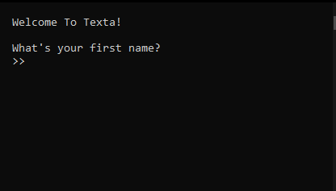
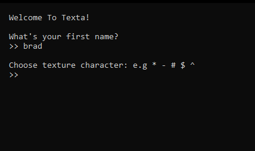
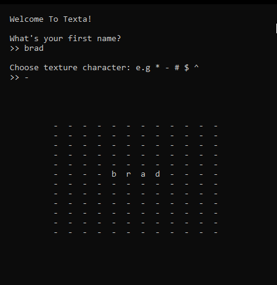

<h1 align="center">TEXTA</h1>

# 

A basic application to display centered text using a pattern of the selected character

## How Does It Work?

- Installation

Compile and run the `index.c` file using any C programming language compiler

- Enter your either a `name` or any `text` you want to display

> _I chose [`brad`](https://traversymedia.com) for this example. Big ups to [Brad Traversy](https://traversymedia.com)!

- Select a character for the pattern

- Viola! :blush:

## Thoughts

In case of any issues, open an issue on this repo or if you're contributing, a pull request is welcome.

_Thank You_
